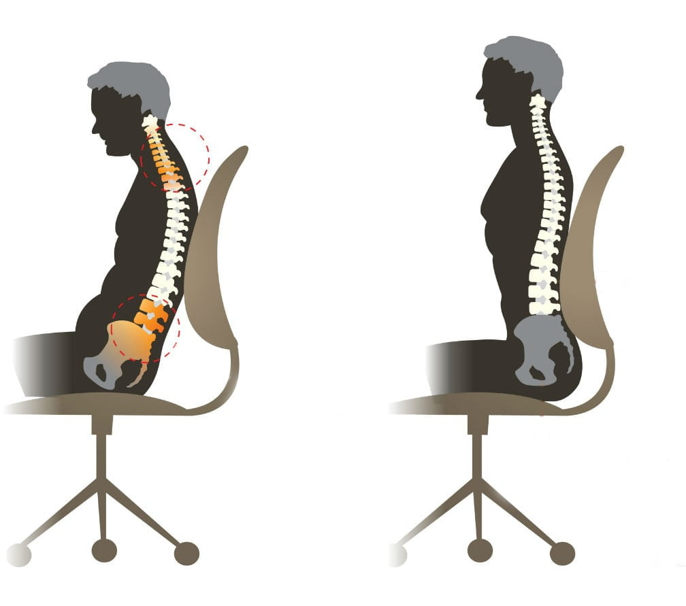
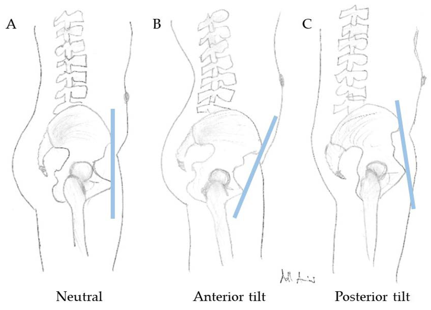

我的坐姿是：**屁股往椅子边缘挪，身体像躺着一样靠椅背**。这类姿势在工位久坐人群里非常典型，也非常“高产”——会同时产出骨盆前倾、腰不适、肩颈酸、呼吸浅、注意力下降等一串问题。

---

## 1) 你的坐姿拆解：你其实在用“椅背”代替“骨盆”

### 1.1 关键动作

* **坐得很浅**：坐骨没有落在椅面有效支撑区（坐深不足）
* **骨盆悬空/不稳**：骨盆没有被椅面稳定托住
* **身体后躺**：上半身向后“挂”在椅背上
* **腰背被动受力**：你不是用骨盆+躯干去“坐”，而是用椅背去“撑”

### 1.2 这个姿势为什么会让你觉得“舒服”

* 它让核心肌群（腹横肌、腹斜肌等）几乎不用工作
* 把维持姿势的任务外包给椅背
* 短期省力、放松；长期等价于“去训练化”（deconditioning）

---

## 2) 由这类坐姿引发的典型问题清单

### 2.1 骨盆与腰椎

* **骨盆前倾加重 / 难回中立**
* **腰椎前凸代偿增加**，久坐后腰部"顶着酸"
* 起身瞬间腰紧、腰发僵
* 站久后下背更容易疲劳

### 2.2 胸椎与肩颈

* **胸椎塌陷（圆肩含胸）**
* 肩胛骨外展、前倾
* **斜方肌上束、肩胛提肌长期过劳** → 肩膀酸、脖子僵
* 头前伸（Forward Head Posture）→ 颈后侧紧、枕部不适

### 2.3 髋关节与下肢

* 髋屈肌群（髂腰肌、股直肌）长期缩短
* 臀大肌抑制（“叫不醒”）
* 腿前侧紧、臀部无力、髋前侧不适或弹响感

### 2.4 呼吸与注意力

* 胸廓塌陷 → 呼吸变浅、上胸呼吸增多
* 久坐更容易困、注意力更难维持（缺氧感与交感紧张并存）

---

## 3) 产生这些问题的“原因链条”（从下到上）

### 3.1 坐得浅：支撑点丢失 → 骨盆被迫找“替代稳定”

当你坐在边缘时，坐骨支撑不足，骨盆无法稳定地“立起来”。人体为了不倒，会自动启用最省事的稳定策略之一：

* **让骨盆前旋一点**，让腰椎前凸“顶住”，形成被动稳定。

这不是你主观想前倾，而是身体的“省力算法”。

### 3.2 身体后躺：椅背受力点不在骨盆 → 腰椎被迫代偿

如果椅背顶住的是腰背而不是骨盆，结果是：

* 上半身重量通过椅背传递
* 骨盆依然不稳
* 腰椎只能通过增加前凸去维持脊柱曲线与平衡

你会形成一种结构：
**骨盆（不稳）—腰椎（硬顶）—胸椎（塌）—肩颈（撑）**

### 3.3 胸椎塌陷 → 肩颈肌肉进入长期“等长抗重力工作”

胸椎一塌，肩胛骨自然前移外展；为了让眼睛继续看屏幕，头会前伸。于是：

* 斜方肌上束、肩胛提肌必须持续工作来“吊住肩带”
* 这就是你说的“肩膀酸”的常见来源：不是拉伤，是长期低强度过劳。

---

## 4) 解决方法：分三层改，不靠意志硬撑

### 第一层：立刻止损（今天开始就能做）

目标：**把支撑从椅背转回到骨盆与坐骨**。

#### A. 坐姿“4个硬指标”（简单但必须严格）

1. **坐深**：屁股坐到椅面 2/3 以上，坐骨压实
2. **骨盆中立**：不要刻意翘也不要刻意压，先找“能轻松呼吸”的位置
3. **背靠方式**：如果要靠椅背，靠的是“骨盆后方/腰背整体”，而不是只靠上背
4. **脚下支撑**：双脚全脚掌着地，膝盖大约 90°–110°，不要悬空

> 最常见的错误：只改上半身，屁股仍然坐在边缘。那基本等于没改。

#### B. 屏幕与输入设备的三点校准（决定肩颈负担）

* 屏幕上沿接近眼高或略低
* 键盘鼠标不要太远（手臂不用前探）
* 肘部可自然垂落，前臂有支撑（桌面或扶手）

#### C. 30–45分钟一次“20秒重置”

不需要站很久，做这个就够：

* 站起来
* 轻收下腹 + 夹臀 5 秒
* 放松
* 重复 2 次

这是在做“神经系统校准”，让你的身体不把前倾当默认。

---

### 第二层：恢复“你缺失的动作”——后倾能力（训练阶段允许过正）

“矫枉必须过正”，放在训练里是对的。目标是：**你得会后倾，才能回中立**。

#### A. 坐姿后倾练习（工位可做）

* 坐直，轻收下腹（像拉拉链）
* 想象尾骨向下、向前“藏一点”
* 维持 8–10 秒，放松
* 每次 6–8 组，一天 2–3 轮

要点：**不是用力耸肩夹背**，而是用下腹与臀部轻参与。

#### B. 髋屈肌松解（建议每天 1 次）

* 选择弓步髋前侧拉伸（每侧 45–60 秒，2 组）
  重点拉的是“髋前侧”，不是腰。

#### C. 臀肌唤醒（每天 1–2 次）

* 桥式（Glute bridge）或站姿夹臀
  目标：让臀大肌重新成为“骨盆的后方牵引者”。

---

### 第三层：固化成“自动姿势”（不用意志硬撑）

很多人失败在这一步：坐着坐着又回去了。所以你需要“结构化约束”。

#### A. 让椅子帮你，而不是害你

* 如果你的椅背曲线顶不到骨盆：加一个薄靠垫（腰垫位置不要太高）
* 椅子太深导致你必须坐浅：加坐垫让你坐满仍能踩地

#### B. 给自己一个“触发器”

例如：

* 每次打开IDE/开始训练/开始写论文：先把屁股坐满
* 每次喝水回来：做20秒重置
  把动作和日常行为绑定，才会长期有效。

---

## 5) 你会关心的一个关键点：要不要“长期后倾”

* **训练时可以后倾**（甚至夸张一点），目的是找回活动范围
* **日常目标必须是中立**
  因为长期后倾会引入另一套问题（腰椎曲度被抹平、下背受压、臀肌紧张）。

判断标准是：

* **你放松时还能稳定在接近中立**，说明矫正开始生效
* **你一放松就前倾塌回去**，说明还需要更多后倾训练与环境改造

---

## 6) 最短路径建议（给你一个“最小可行方案”）

如果你只愿意做最少的事，请只做这三条，坚持两周：

1. **屁股坐满椅面**（这是根因级别）
2. **屏幕抬高 + 键鼠拉近**（这是肩颈级别）
3. **每45分钟一次20秒重置**（这是系统级别）

大概率你会发现：肩酸先缓解，腰更稳，骨盆更容易回中立。

